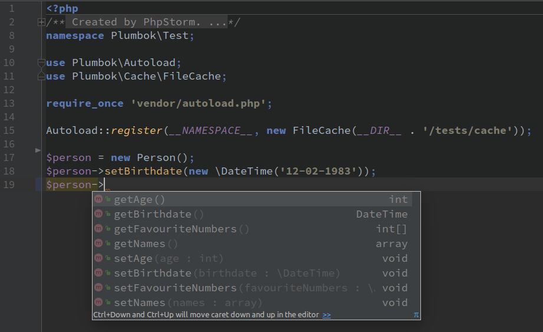

Plumbok
=======

Runtime Code Generator like Lombok for PHP.

Code generation starts when additional autoloader detects class uses Plumbok annotations
and loads newly generated code with added methods in preprocess step.


[](https://github.com/MJKruszewski/plumbok/blob/master/LICENSE)

---

## Installation

### Install with Composer

```bash
composer require mjkruszewski/plumbok
```

## Usage

### Using autoloader at runtime on develop

Registering additional autoloader:

```php
require 'vendor/autoload.php';

Plumbok\Autoload::register('Plumbok\\Test');
```

Using annotations in class:

```php
namespace Plumbok\Test;

/**
 * @Data
 * @ToString(property = "email")
 */
class Person
{
    /**
     * @var array
     * @Getter @Setter
     */
    private $names = [];
    
    /**
     * @var string
     * @Getter @Setter
     */
    private $email;

    /**
     * Holds age
     * @var int
     * @Getter @Setter
     */
    private $age;

    /**
     * @var \DateTime
     * @Getter @Setter
     */
    private $birthdate;

    /**
     * @var int[]
     * @Getter @Setter
     */
    private $favouriteNumbers = [1, 7, 14, 21, 28];
}
```

After first run your original code will be little modified with 
additional docblock ennotations (tags) in PhpDocumentor style.

This is needed if your IDE doesn't have **Plumbok** plugin.



```php
namespace Plumbok\Test;

/**
 * @Data 
 * @ToString(property = "email")
 * @method void __construct(int $age, \DateTime $birthdate)
 * @method array getNames()
 * @method void setNames(array $names)
 * @method string getEmail()
 * @method void setEmail(string $email)
 * @method string toString()
 * @method int getAge()
 * @method void setAge(int $age)
 * @method \DateTime getBirthdate()
 * @method void setBirthdate(\DateTime $birthdate)
 * @method int[] getFavouriteNumbers()
 * @method void setFavouriteNumbers(int[] $favouriteNumbers)
 */
class Person
{
    /**
     * @var array
     * @Getter @Setter
     */
    private $names = [];
    
    /**
     * @var string
     * @Getter @Setter
     */
    private $email;
    
    /**
     * Holds age
     * @var int
     * @Getter @Setter
     */
    private $age;

    /**
     * @var \DateTime
     * @Getter @Setter
     */
    private $birthdate;

    /**
     * @var int[]
     * @Getter @Setter
     */
    private $favouriteNumbers = [1, 7, 14, 21, 28];
}
```

This preprocessing step allows IDE to recognise generated methods from docblock.
Second step is including generated code which looks like:

```php
namespace Plumbok\Test;

/**
 * @Data 
 * @ToString(property = "email")
 */
class Person
{
    /**
     * @var array
     * @Getter @Setter
     */
    private $names = [];
    /**
     * Holds age
     * @var int
     * @Getter @Setter
     */
    private $age;
    /**
     * @var \DateTime
     * @Getter @Setter
     */
    private $birthdate;
    /**
     * @var int[]
     * @Getter @Setter
     */
    private $favouriteNumbers = [1, 7, 14, 21, 28];
    /**
     * Person constructor.
     *
     * @param int $age
     * @param \DateTime $birthdate
     */
    public function __construct(int $age, \DateTime $birthdate)
    {
        $this->age = $age;
        $this->birthdate = $birthdate;
    }
    /**
     * Retrieves names
     *
     * @return array 
     */
    public function getNames() : array
    {
        return $this->names;
    }
    /**
     * Sets names
     *
     * @param array $names
     * @return void 
     */
    public function setNames(array $names)
    {
        $this->names = $names;
    }
    
    /**
     * Retrieves email
     *
     * @return string 
     */
    public function getEmail() : string
    {
        return $this->email;
    }
    
    /**
     * Sets email
     *
     * @param string $email string
     * @return void
     */
    public function setEmail(string $email)
    {
        return $this->email = $email;
    }
    
    /**
     * Returns string from $email
     *
     * @return string 
     */
    public function toString() : string
    {
        return (string) $this->email;
    }

    /**
     * Retrieves age
     *
     * @return int 
     */
    public function getAge() : int
    {
        return $this->age;
    }
    /**
     * Sets age
     *
     * @param int $age
     * @return void 
     */
    public function setAge(int $age)
    {
        $this->age = $age;
    }
    /**
     * Retrieves birthdate
     *
     * @return \DateTime 
     */
    public function getBirthdate() : \DateTime
    {
        return $this->birthdate;
    }
    /**
     * Sets birthdate
     *
     * @param \DateTime $birthdate
     * @return void 
     */
    public function setBirthdate(\DateTime $birthdate)
    {
        $this->birthdate = $birthdate;
    }
    /**
     * Retrieves favouriteNumbers
     *
     * @return int[] 
     */
    public function getFavouriteNumbers() : array
    {
        return $this->favouriteNumbers;
    }
    /**
     * Sets favouriteNumbers
     *
     * @param int[] $favouriteNumbers
     * @return void 
     */
    public function setFavouriteNumbers(array $favouriteNumbers)
    {
        $this->favouriteNumbers = $favouriteNumbers;
    }
}
```

### Using prebuild command in CLI for test and prod

Use CLI to run `plumbok` executable.

```bash
bin/plumbok [src-directory] [cache-directory]
```

> Note! This usage still requires adding autoload in bootstrap file!

Using CLI to run `plumbok` executable and replace source code with generated one.

```bash
bin/plumbok [src-directory] --inline
```

Additional options:

* `--ext`, `-e` pass file extension to look classes for, default `php`
* `--no-tags` won't push `@method` tags into source file
* `--inline` will replace source code with generated one
* `-v|vv|vvv` increases verbosity
* `--help`, `-h` display help

---

## License

The MIT License (MIT)

Copyright (c) 2016 Michał Brzuchalski <michal.brzuchalski@gmail.com>

Permission is hereby granted, free of charge, to any person obtaining a copy
of this software and associated documentation files (the "Software"), to deal
in the Software without restriction, including without limitation the rights
to use, copy, modify, merge, publish, distribute, sublicense, and/or sell
copies of the Software, and to permit persons to whom the Software is
furnished to do so, subject to the following conditions:

The above copyright notice and this permission notice shall be included in
all copies or substantial portions of the Software.

THE SOFTWARE IS PROVIDED "AS IS", WITHOUT WARRANTY OF ANY KIND, EXPRESS OR
IMPLIED, INCLUDING BUT NOT LIMITED TO THE WARRANTIES OF MERCHANTABILITY,
FITNESS FOR A PARTICULAR PURPOSE AND NONINFRINGEMENT. IN NO EVENT SHALL THE
AUTHORS OR COPYRIGHT HOLDERS BE LIABLE FOR ANY CLAIM, DAMAGES OR OTHER
LIABILITY, WHETHER IN AN ACTION OF CONTRACT, TORT OR OTHERWISE, ARISING FROM,
OUT OF OR IN CONNECTION WITH THE SOFTWARE OR THE USE OR OTHER DEALINGS IN
THE SOFTWARE.